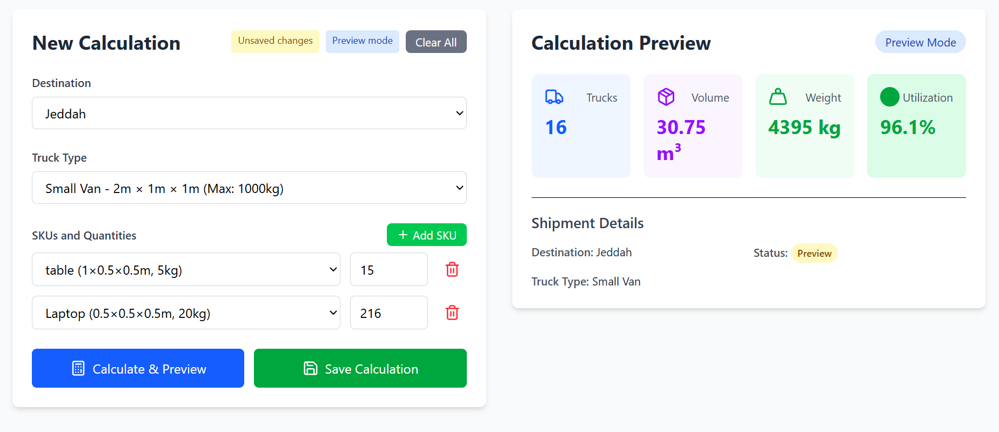

# 🚛 Truck Utilization Calculator – 525K.io  Task

An AI-first logistics tool that calculates the number of trucks required for a given set of SKUs, displays truck space utilization visually, and suggests SKU optimizations to improve usage efficiency.

---

## 📦 Project Structure
### 🚀 How to Run Locally

### Prerequisites:
- Node.js v20+

### Installation & Run (From Project Root):
#### 1. Install dependencies
```bash

cd frontend 
npm install
cd backend  
npm install
```
#### Start Backend :
  ```bash
  cd backend
  npm run dev
```
#### Start Frontend :
  ```bash
  cd frontend
  npm run dev
```

#### Ports
- Frontend: http://localhost:5173

- Backend: http://localhost:3000

## Sample Inputs & outputs




## Visual Design
i used 3D  representation to show each SKU as a colored box.


## 🧠 AI-Driven Development Workflow
AI was used throughout the project in:
| Phase                          | How AI Was Used                                                                          |
| ------------------------------ | ---------------------------------------------------------------------------------------- |
| **User Stories & Assumptions** | Prompted AI to define user stories, acceptance criteria, and assumptions.                |
| **Backend Development**        | Ask him to build backend base on prev Phase                                              |
| **Frontend UI**                | Ask him to build frontend Base on prev Phases                                            |
| **Testing**                    | Ask him to build unit and itergtion test base on backend service and APIs                |
